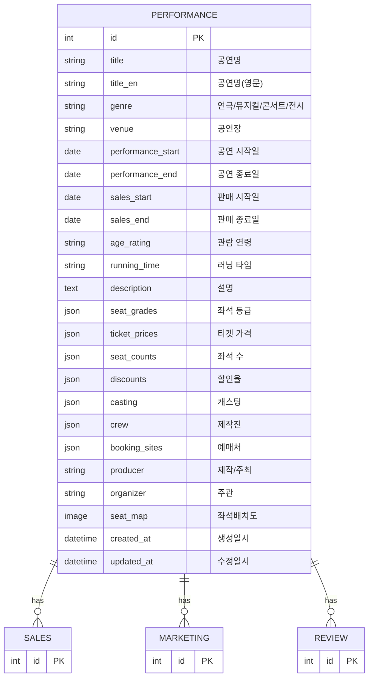

# Library AI

## 기술 스택

- **Backend**: Django
- **Database**: PostgreSQL
- **Frontend**: Django Templates + Tailwind CSS (django-tailwind)
- **Charts**: Chart.js (직관적인 시각화 중심)
- **Data Processing**: pandas (엑셀 파일 처리 및 데이터 분석)
- **Environment**: django-environ
- **Deployment**: GCP (Cloud Run / App Engine)

## 개발 환경 설정

1. PostgreSQL 설치 및 실행
2. 가상환경 생성 및 활성화: `python -m venv venv`
3. 가상환경 활성화: `source venv/bin/activate` (macOS/Linux)
4. 패키지 설치: `pip install -r requirements.txt`
5. Tailwind CSS 설정: `python manage.py tailwind init`
6. Tailwind CSS 빌드: `python manage.py tailwind build`
7. 마이그레이션: `python manage.py migrate`
8. 개발 서버 실행: `python manage.py runserver`
9. Tailwind CSS 개발 모드 (별도 터미널): `python manage.py tailwind dev`

## 데이터 흐름

### 데이터 관계 다이어그램



1. **공연 관리**: 공연을 생성하고 장르별로 분류
   - 연극, 뮤지컬, 콘서트, 전시 등

2. **데이터 관리**: 각 공연에 대해 데이터 입력
   - 매출 데이터: 공연별 매출 정보
   - 마케팅 데이터: 공연별 마케팅 정보
   - 리뷰 데이터: 공연별 리뷰 정보

3. **대시보드**: 공연에 연결된 모든 데이터를 통합하여 시각화
   - 통합 대시보드: 전체 공연 데이터 종합
   - 장르별 대시보드: 장르별 공연 데이터
   - 공연별 대시보드: 특정 공연의 매출/마케팅/리뷰 데이터 통합

### 데이터 관리 방식

- **공연 정보**: 웹 폼을 통한 수동 입력 (공연 관리)
- **매출/마케팅/리뷰 데이터**: 웹 폼 또는 엑셀 업로드를 통한 입력 (데이터 관리)

## 디자인 시스템

- **브랜드 컬러**: #f65938 (로고, 브랜드명에만 사용)
- **Primary 컬러**: #2a3038 (액션 버튼, 링크, 강조 요소)
- **배경**: 흰색 (#ffffff), Primary 연한 버전 (#2a3038/5)
- **텍스트**: 검은색 (#000000), 회색 (#666666)
- **폰트**: Pretendard
- **스타일**: 토스 디자인 철학 + Mixpanel 데이터 대시보드 구조
- **상세 가이드**: `docs/design-system.md` 참고

## 프로젝트 구조

```
config/                   # Django 프로젝트 루트
├── settings.py           # 설정 파일
├── core/                 # 공통 기능
├── performance/          # 공연 관리
├── data_management/      # 데이터 관리 (매출, 마케팅, 리뷰)
├── dashboard/            # 대시보드 (통합/장르별/공연별)
├── theme/                # Tailwind CSS 설정
├── templates/            # 공통 템플릿 (base.html 등)
├── docs/                 # 문서
└── media/                # 업로드 파일
```

## 개발 원칙

- 서비스 레이어 분리 (views.py와 services.py 분리)
- 앱별 템플릿 구조
- Django Admin 최소 커스터마이징
- 비전문가(공연업계 종사자)가 쉽게 이해할 수 있는 직관적인 데이터 시각화

## URL 구조

```
/login/                      → 로그인 페이지
/logout/                     → 로그아웃
/                            → 통합 대시보드 (전체)
/dashboard/theater/          → 연극 대시보드
/dashboard/musical/          → 뮤지컬 대시보드
/dashboard/concert/          → 콘서트 대시보드
/dashboard/exhibition/       → 전시 대시보드
/performance/                → 공연 목록
/performance/create/         → 공연 등록
/performance/<id>/           → 공연 상세
/performance/<id>/edit/      → 공연 수정
/performance/<id>/dashboard/ → 공연별 대시보드
/data/sales/                 → 매출 데이터 관리
/data/marketing/             → 마케팅 데이터 관리
/data/review/                → 리뷰 데이터 관리
```
