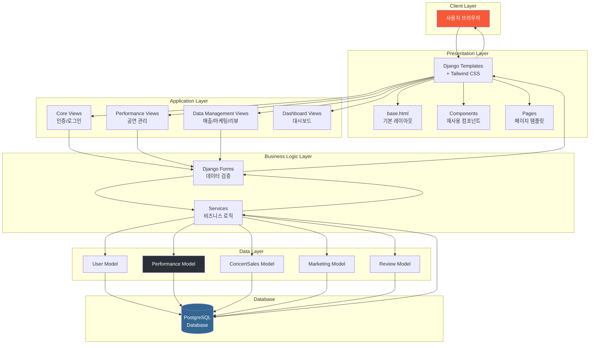
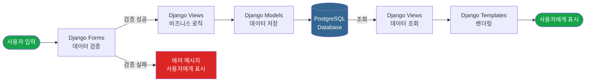
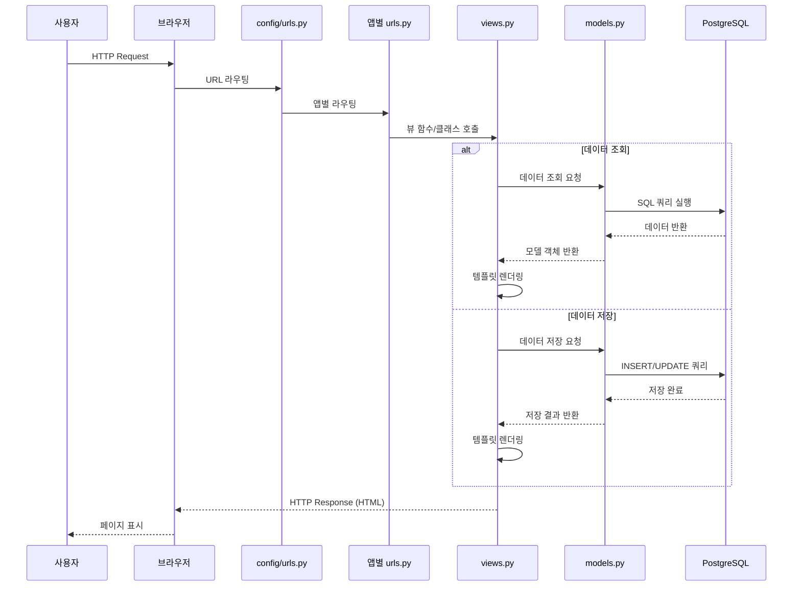
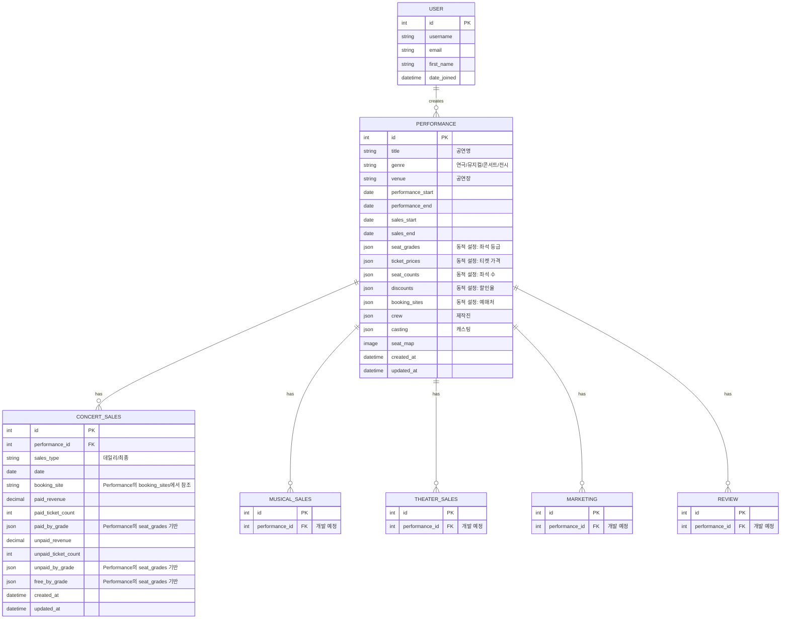

# 개발 가이드

Library AI 프로젝트의 개발 가이드입니다.

## 1. 기술 스펙

### Backend
- **Framework**: Django 5.2.8 (LTS)
- **Language**: Python 3.11+
- **Database**: PostgreSQL
- **Database Adapter**: psycopg2-binary 2.9.11 - PostgreSQL Python 어댑터
- **ORM**: Django ORM

### Frontend
- **Templates**: Django Templates
- **CSS Framework**: Tailwind CSS 4.x (django-tailwind)
- **Charts**: Chart.js
- **Font**: Pretendard

### Data Processing
- **pandas**: 2.3.3 - 데이터 분석 및 처리
- **openpyxl**: 3.1.5 - Excel 파일 처리

### Image Processing
- **Pillow**: 11.0.0 - 이미지 처리

### Environment & Deployment
- **django-environ**: 0.12.0 - 환경 변수 관리
- **Deployment**: GCP (Cloud Run / App Engine)

### Utilities
- **python-dateutil**: 2.9.0.post0 - 날짜/시간 처리 유틸리티

### 주요 의존성
```
Django==5.2.8
psycopg2-binary==2.9.11
django-environ==0.12.0
django-tailwind==4.4.1
pandas==2.3.3
openpyxl==3.1.5
Pillow==11.0.0
python-dateutil==2.9.0.post0
```

---

## 2. 개발 환경 설정

### 필수 요구사항
- Python 3.11 이상
- PostgreSQL 12 이상
- Node.js 18 이상 (Tailwind CSS 빌드용)

### 환경 설정 단계

#### 1. 저장소 클론
```bash
git clone <repository-url>
cd library_ai
```

#### 2. 가상환경 생성 및 활성화
```bash
# 가상환경 생성
python -m venv venv

# 가상환경 활성화 (macOS/Linux)
source venv/bin/activate

# 가상환경 활성화 (Windows)
venv\Scripts\activate
```

#### 3. 의존성 설치
```bash
pip install -r requirements.txt
```

#### 4. PostgreSQL 데이터베이스 설정
```bash
# PostgreSQL 접속
psql -U postgres

# 데이터베이스 생성
CREATE DATABASE library_ai;

# 사용자 생성 및 권한 부여
CREATE USER library_ai_user WITH PASSWORD 'your_password';
GRANT ALL PRIVILEGES ON DATABASE library_ai TO library_ai_user;
```

#### 6. Tailwind CSS 설정
```bash
# Tailwind CSS 초기화
python manage.py tailwind init

# Tailwind CSS 빌드
python manage.py tailwind build
```

#### 7. 데이터베이스 마이그레이션
```bash
# 마이그레이션 생성
python manage.py makemigrations

# 마이그레이션 적용
python manage.py migrate
```

#### 8. 관리자 계정 생성
```bash
python manage.py createsuperuser
```

#### 9. 개발 서버 실행
```bash
# Django 개발 서버 실행
python manage.py runserver

# Tailwind CSS 개발 모드 (별도 터미널)
python manage.py tailwind dev
```

### 개발 워크플로우
1. 코드 수정
2. Tailwind CSS 자동 빌드 (개발 모드 실행 시)
3. 브라우저에서 확인 (`http://localhost:8000`)

---

## 3. 프로젝트 구조

```
library_ai/
├── config/                    # Django 프로젝트 설정
│   ├── settings.py           # 프로젝트 설정
│   ├── urls.py               # 메인 URL 설정
│   ├── wsgi.py               # WSGI 설정
│   └── asgi.py               # ASGI 설정
│
├── core/                      # 공통 기능
│   ├── models.py             # User 모델 (Django 기본)
│   ├── views.py              # 로그인/로그아웃 뷰
│   ├── forms.py              # 인증 폼
│   ├── admin.py              # User Admin 커스터마이징
│   ├── urls.py               # 인증 URL
│   └── templatetags/         # 커스텀 템플릿 태그
│       ├── custom_filters.py
│       └── performance_tags.py
│
├── performance/               # 공연 관리 앱
│   ├── models.py             # Performance 모델
│   ├── views.py              # CRUD 뷰
│   ├── forms.py              # Performance 폼
│   ├── admin.py              # Performance Admin
│   └── urls.py               # 공연 URL
│
├── data_management/          # 데이터 관리 앱
│   ├── models.py             # ConcertSales 모델
│   ├── views.py              # 매출 관리 뷰
│   ├── forms.py              # 매출 폼
│   ├── admin.py              # 매출 Admin
│   └── urls.py               # 데이터 관리 URL
│
├── dashboard/                # 대시보드 앱
│   ├── views.py              # 대시보드 뷰
│   └── urls.py               # 대시보드 URL
│
├── theme/                    # Tailwind CSS 설정
│   ├── static_src/
│   │   └── src/
│   │       └── styles.css    # Tailwind CSS 소스
│   └── static/
│       └── css/
│           └── dist/
│               └── styles.css # 빌드된 CSS
│
├── templates/                # 공통 템플릿
│   ├── base.html             # 기본 레이아웃
│   ├── components/           # 재사용 컴포넌트
│   │   ├── action_buttons.html
│   │   ├── genre_dropdown.html
│   │   ├── pagination.html
│   │   └── search_filter.html
│   ├── core/                 # 인증 템플릿
│   │   └── login.html
│   ├── performance/           # 공연 템플릿
│   │   ├── list.html
│   │   ├── detail.html
│   │   ├── form.html
│   │   └── confirm_delete.html
│   └── data_management/      # 데이터 관리 템플릿
│       ├── performance_list.html
│       └── concert_sales/
│           ├── list.html
│           ├── form.html
│           └── confirm_delete.html
│
├── docs/                      # 문서
│   ├── design-system.md      # 디자인 시스템 가이드
│   └── development-guide.md  # 개발 가이드 (본 문서)
│
├── media/                     # 업로드 파일
├── static/                    # 정적 파일
├── venv/                      # 가상환경 (gitignore)
├── manage.py                  # Django 관리 스크립트
├── requirements.txt           # Python 의존성
└── README.md                  # 프로젝트 개요
```

### 앱별 역할

#### core
- 사용자 인증 (로그인/로그아웃)
- 커스텀 템플릿 태그 및 필터
- 공통 유틸리티

#### performance
- 공연 정보 관리 (CRUD)
- 공연별 동적 설정값 관리 (좌석 등급, 예매처 등)
- 공연 목록, 상세, 등록, 수정, 삭제

#### data_management
- 매출 데이터 관리 (현재: 콘서트)
- 마케팅 데이터 관리 (개발 예정)
- 리뷰 데이터 관리 (개발 예정)
- 공연 기반 데이터 입력 및 관리

#### dashboard
- 통합 대시보드
- 장르별 대시보드 (개발 예정)
- 공연별 대시보드 (개발 예정)

---

## 4. 시스템 구조도

### 전체 시스템 아키텍처



### 데이터 흐름



### 요청 처리 흐름



---

## 5. 데이터 관계 다이어그램

### ERD (Entity Relationship Diagram)



### 데이터 관계 설명

#### 1. Performance (공연) - 중심 엔티티
- 모든 데이터의 중심이 되는 엔티티
- 동적 설정값을 JSON 필드로 관리:
  - `seat_grades`: 좌석 등급 리스트 (예: ["VIP", "R석", "S석"])
  - `booking_sites`: 예매처 리스트 (예: [{"인터파크": "https://..."}])
  - `ticket_prices`: 티켓 가격 딕셔너리 (예: {"VIP": 150000})
  - `seat_counts`: 좌석 수 딕셔너리 (예: {"VIP": 50})
  - `discounts`: 할인율 딕셔너리 (예: {"VIP": {"조조할인": 10}})

#### 2. Sales (매출) - Performance 기반
- `ConcertSales`, `MusicalSales`, `TheaterSales` 등 장르별 모델
- `performance` ForeignKey로 Performance 참조
- Performance에서 정의한 값만 사용 가능:
  - `booking_site`: Performance의 `booking_sites`에서 선택
  - `paid_by_grade`, `unpaid_by_grade`, `free_by_grade`: Performance의 `seat_grades` 기반

#### 3. 데이터 무결성 보장
- Performance에서 정의하지 않은 값은 Sales에서 사용 불가
- 폼 검증을 통해 데이터 일관성 보장
- `limit_choices_to`로 장르별 필터링

---

## 6. 개발 원칙

### 1. 공연 중심 데이터 구조 (온톨로지)
- **원칙**: 모든 데이터는 공연(Performance)을 중심으로 구조화
- **구현**: 
  - Performance에서 동적 설정값 정의
  - 하위 데이터(Sales, Marketing, Review)는 Performance의 설정값만 사용
  - 데이터 검증을 통한 무결성 보장

### 2. 동적 설정 가능한 구조
- **원칙**: 시스템 고정값 제거, 사용자가 공연별로 직접 정의
- **구현**:
  - JSON 필드를 활용한 유연한 데이터 구조
  - 폼에서 동적 입력 필드 생성
  - 예외 처리 강화

### 3. 사용자 중심 설계
- **원칙**: 비전문가(공연업계 종사자)가 쉽게 사용할 수 있는 인터페이스
- **구현**:
  - 직관적인 UI/UX
  - 친근한 톤앤보이스 (어요/해요 체)
  - 명확한 에러 메시지 및 도움말

### 4. 코드 네이밍 가이드
- **HTML/CSS 클래스**: 소문자 또는 kebab-case (`btn-primary`, `card-dashboard`)
- **Python 클래스**: PascalCase (`Performance`, `ConcertSales`)
- **외부 서비스 이름 사용 금지**: `TossButton`, `MixpanelCard` 등 사용하지 않음

### 5. 서비스 레이어 분리
- **원칙**: views.py와 services.py 분리 (향후 적용)
- **현재**: views.py에 비즈니스 로직 포함
- **향후**: 복잡한 로직은 services.py로 분리 예정

### 6. 앱별 템플릿 구조
- **원칙**: 각 앱의 템플릿은 `templates/{app_name}/` 디렉토리에 위치
- **공통 컴포넌트**: `templates/components/` 디렉토리에 재사용 컴포넌트
- **기본 레이아웃**: `templates/base.html`

### 7. Django Admin 최소 커스터마이징
- **원칙**: Django Admin은 개발/관리용으로만 사용
- **구현**: 기본 Admin 기능 활용, 최소한의 커스터마이징만 수행

### 8. 데이터 검증
- **원칙**: 폼 레벨과 모델 레벨에서 이중 검증
- **구현**:
  - `forms.py`에서 폼 검증
  - `models.py`에서 모델 검증
  - Performance의 설정값 기반 검증

### 9. 에러 처리
- **원칙**: 사용자 친화적인 에러 메시지 제공
- **구현**:
  - Django Messages Framework 활용
  - 친근한 톤의 에러 메시지
  - 해결 방법 제시

### 10. 확장 가능한 구조
- **원칙**: 새로운 장르, 새로운 데이터 타입 추가 용이
- **구현**:
  - 앱별 독립적인 구조
  - 공통 인터페이스 활용
  - 재사용 가능한 컴포넌트

---

## 참고 자료

- [Django 공식 문서](https://docs.djangoproject.com/)
- [Tailwind CSS 문서](https://tailwindcss.com/docs)
- [Chart.js 문서](https://www.chartjs.org/docs/)
- [디자인 시스템 가이드](./design-system.md)

